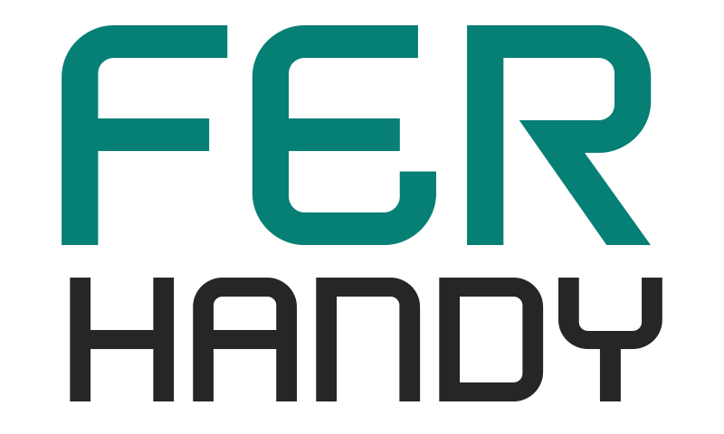

<div align="center">
  
</div>

# FER Handy - Astro Website

Sitio web profesional para servicios de construcción y mantenimiento, construido con **Astro** y **Tailwind CSS**.

## Características

- Sitio estático ultra-rápido con Astro
- Diseño responsive con Tailwind CSS 4
- Soporte multiidioma (Inglés/Español)
- Optimizado para móviles
- Animaciones CSS suaves
- SEO optimizado

## Instalación

1. **Instalar dependencias:**

```bash
npm install
```

2. **Ejecutar en desarrollo:**

```bash
npm run dev
```

El sitio estará disponible en `http://localhost:4321`

3. **Construir para producción:**

```bash
npm run build
```

4. **Previsualizar la build:**

```bash
npm run preview
```

## Estructura del Proyecto

```
src/
├── components/          # Componentes Astro reutilizables
│   ├── About.astro
│   ├── Contact.astro
│   ├── Footer.astro
│   ├── Hero.astro
│   ├── NavBar.astro
│   ├── Services.astro
│   └── Testimonials.astro
├── i18n/               # Internacionalización
│   ├── config.ts
│   └── locales/
│       └── translations.ts
├── layouts/            # Layouts de página
│   └── Layout.astro
├── pages/              # Páginas del sitio
│   └── index.astro
├── styles/             # Estilos globales
│   ├── animations.css
│   ├── components.css
│   └── global.css
├── types/              # Definiciones TypeScript
│   └── index.ts
└── utils/              # Utilidades
    └── astro-helpers.ts
```

## Cambiar Idioma

El idioma se puede cambiar agregando el parámetro `?lang=es` o `?lang=en` a la URL:

- Inglés: `http://localhost:4321/?lang=en`
- Español: `http://localhost:4321/?lang=es`

## Personalización

### Colores

Los colores principales se pueden modificar directamente en los componentes usando las clases de Tailwind.

### Traducciones

Las traducciones se encuentran en `src/i18n/locales/translations.ts`.

### Imágenes

Las imágenes deben colocarse en la carpeta `public/images/`.

## Scripts Disponibles

- `npm run dev` - Inicia el servidor de desarrollo
- `npm run build` - Construye el sitio para producción
- `npm run preview` - Previsualiza la build de producción
- `npm run astro` - Ejecuta comandos CLI de Astro

## Tecnologías

- [Astro](https://astro.build) - Framework web moderno
- [Tailwind CSS](https://tailwindcss.com) - Framework CSS utility-first
- [TypeScript](https://www.typescriptlang.org) - JavaScript con tipos
- [Lucide Icons](https://lucide.dev) - Iconos SVG

## Licencia

Privado - © 2025 FER Handy
